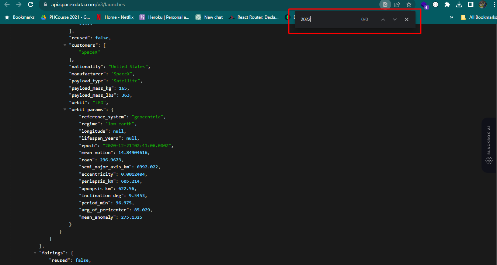
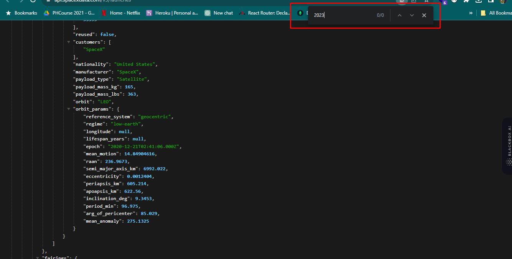
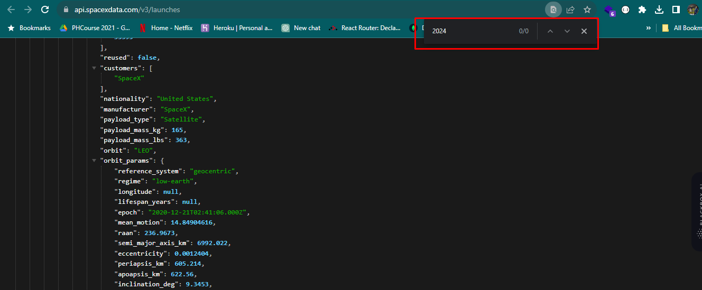

#### This is a Space-X-test project. Created by Next.js 

This is live server (https://test-space-x.netlify.app)

Created a React leatest which is next.js Project and using every component by JSX.

Used Context, hooks (axios), routing by next.js pattern. and all the functional component with no props drilling.

Used Given API

Build the given Figma interface. 

Used External framework Bootstrap 5

Used customize css variables to change the typo and color and alignments.

Made the page responsive with extra two displa, Tab + mobile.

Data can be show by search by it's rocket name

It can show launch status ( Failure, Success )

Launch date also data can get on consol. 

Added paginations, Only 9 itmes show each page.

# Note
There are no last week or last month or last year data on API. and i haven't found on 
Last year Screenshot:

This year screen shot

All upcoming data also cannot show, becasue those data are not in here.
Upcomming Date: 

